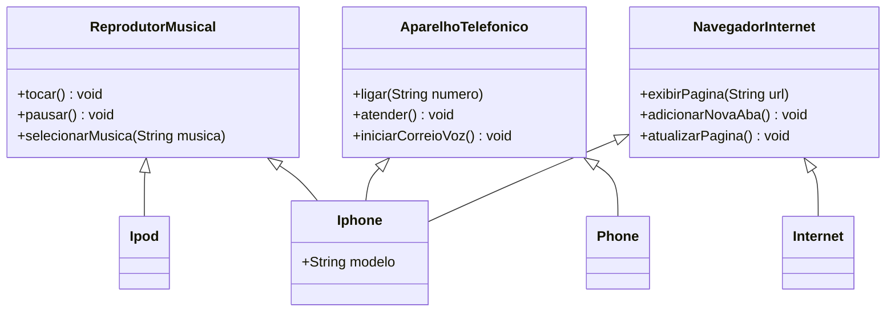

# Desafio POO - UML

### Desafio Modelagem e Diagramação de um Componente iPhone


```mermaid
classDiagram
    ReprodutorMusical <|-- Ipod
    AparelhoTelefonico <|-- Phone
    NavegadorInternet <|-- Internet
    ReprodutorMusical <|-- Iphone
    AparelhoTelefonico <|-- Iphone
    NavegadorInternet <|-- Iphone
    Iphone : +String modelo
    class ReprodutorMusical{
      +tocar()void
      +pausar()void
      +selecionarMusica(String musica)
    }
    class AparelhoTelefonico{
      +ligar(String numero)
      +atender()void
      +iniciarCorreioVoz()void
    }
    class NavegadorInternet{
      +exibirPagina(String url)
      +adicionarNovaAba()void
      +atualizarPagina()void
    }
```
exemplo em https://github.com/glysns/trilha-java-basico/desafios/poo/README.md
```` 
